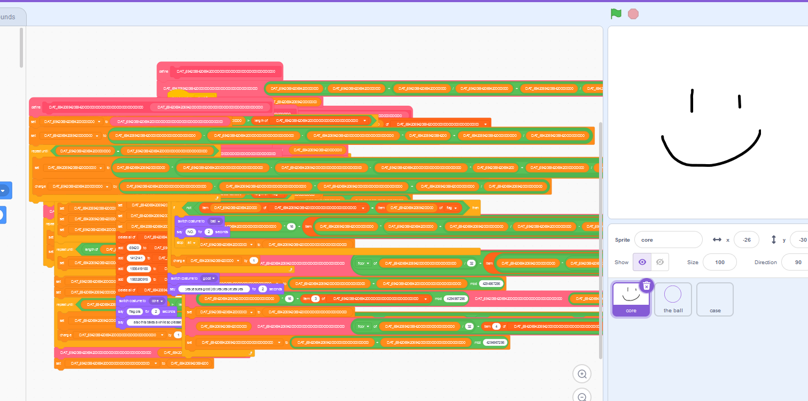
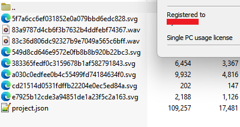
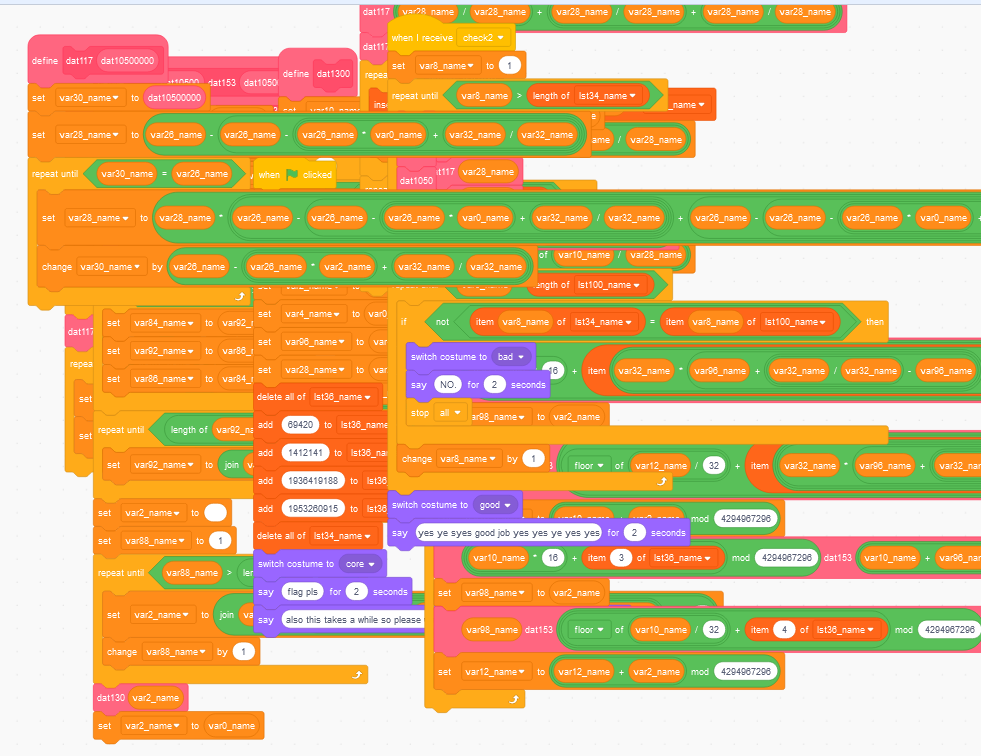
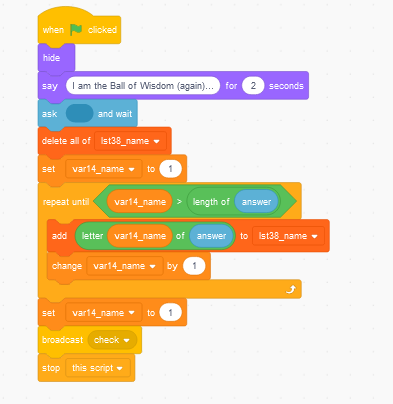
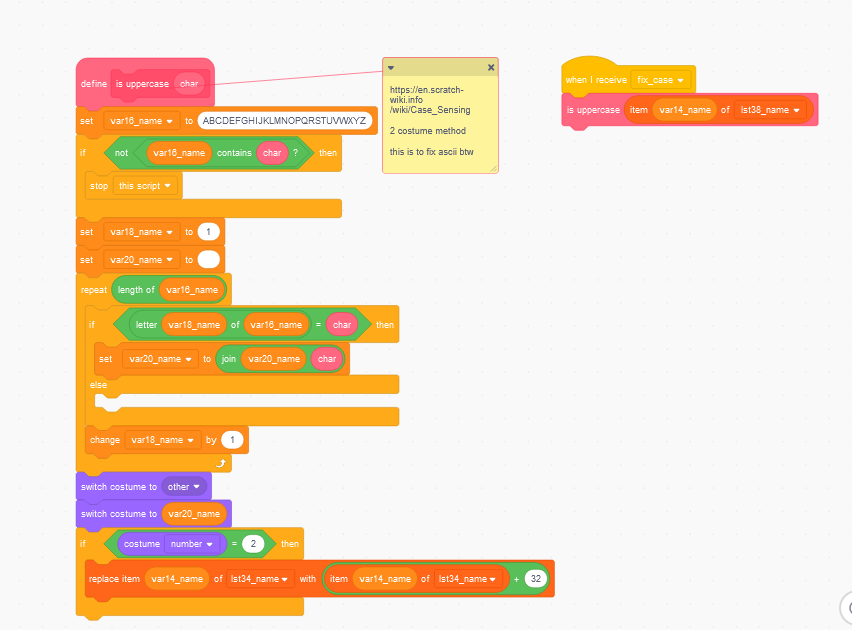

_sorry i didn't save the task description_

#### Overview

When we open the provided `flagchecker.sb3` file using the online IDE by [mit.edu](https://scratch.mit.edu/projects/editor/) we see this: \


When i tried to run this program it asked me for a flag, then this smiley face changed and it said that my input is invalid. 

#### Deobfuscation (renaming)

The first thing that came to my mind when i was looking at this was that i need to rename all these nonsense variable names with something a bit more understandable for me, like when ida renames vars to `v1`, `v2`, etc. \

To achieve that, first, we should find a way how to read this project file and match the encrypted names. \
When i opened the `.sb3` file in the hex editor i saw immediately that there's a `PK` header at the very beginning of the file, so it means that this sb3 project is just a ZIP that i can extract using WinRAR, and that's what i did. 

The project structure looked like this and to be honest i didn't even check the other files besides the `project.json`. \


If you didn't know what scratch projects look like internally then you're at the right place because now we're going to parse this JSON file and rename all the obfuscated trash that we have.

```json
{
  "targets": [
    {
      "isStage": true,
      "name": "Stage",
      "variables": {
        ",jz[(4_X##dTi9W;t8XU": [
          "DAT_6942069420694200",
          "0"
        ],
        "=1{oy2dsx.too!2-CsG?": [
          "DAT_694206942069420000000000000000000000000",
          "0"
        ],
        "CBt]K5|$xvqqGjtkk.c!": [
          "DAT_694206942069420000000000000000",
          "0"
        ],
        "eF=OscfBn~/6#|vo_SC|": [
          "DAT_69420694206942000000000000000",
          32
        ],
...
```

I don't wanna go into much detail on how i did it, i'm just gonna post the script that i quickly coded to rename all this crap.

```py
from json import loads


i = 0
replace = {}


def get_name(name: str, add_prefix: bool) -> str:
    global i

    if not add_prefix:
        return name

    return f'{name}{i - 1}'


def store_name(old: str, name: str, add_prefix: bool = True) -> str:
    global i
    if old in ['NUM1', 'NUM2', 'VALUE', 'INDEX', 'STRING1', 'STRING2', 'OPERAND1', 'OPERAND2',
               'COSTUME', 'STRING', 'ITEM', 'SUBSTACK', 'LETTER', 'CONDITION', 'TIMES', 'OPERAND',
               'BROADCAST_INPUT', 'SECS', 'MESSAGE', 'custom_block', 'NUM']:
        return old
    if old in ['encode', 'decode', '%s', 'is']:
        return old

    i += 1
    if old in replace:
        print(f'WARNING: duplicate name {old}')
        return replace[old]

    replace[old] = get_name(name, add_prefix)
    return replace[old]


def main() -> None:
    with open('./project.json', 'r') as f:
        content_raw = f.read()
        content = loads(content_raw)

    for target in content['targets']:
        for var_name in target['variables']:
            v_name: str = store_name(var_name, 'var')
            store_name('"' + target['variables'][var_name][0] + '"', f'"{v_name}_name"', False)

        for list_name in target['lists']:
            v_name: str = store_name(list_name, 'lst')
            store_name('"' + target['lists'][list_name][0] + '"', f'"{v_name}_name"', False)

        for broadcast_name in target['broadcasts']:
            store_name(broadcast_name, 'brd')

        for block_name in target['blocks']:
            store_name(block_name, 'blk')

            for input_name in target['blocks'][block_name]['inputs']:
                store_name(input_name, 'inp')

            if 'mutation' in target['blocks'][block_name] and 'proccode' in target['blocks'][block_name]['mutation']:
                for input_name in target['blocks'][block_name]['mutation']['proccode'].split(' '):
                    if 'DAT' in input_name:
                        store_name(input_name, 'dat')

        if 'comments' in target:
            for comment_name in target['comments']:
                store_name(comment_name, 'cmt')

    for key, value in replace.items():
        content_raw = content_raw.replace(key, value)

    with open('./project_renamed.json', 'w') as f:
        f.write(content_raw)


if __name__ == '__main__':
    main()
```

After the renaming project looked like this:


It still looked a bit weird but i guess that's what i had to deal with, and that's when i started to look at the code that we have.


#### Understanding the code

At the very beginning of this program, the app is initializing some variables that it's going to use in the obfuscated routines, and then there are also some other functions in the other views(_if you are like me and you didn't know, you can put your code into different objects in scratch, you can store your code almost everythere_), so we have a lot weird functions at the main scene object, some more understandable code on the other objects and that's how it looked like.

 

So the algorithm of this program is:
1. Ask the user for a flag
2. Split the flag to the characters
3. Gets an index of the character from a hardcoded alphabet ``` !\"#$ % &'()*+,-./0123456789:;<=>?@ABCDEFGHIJKLMNOPQRSTUVWXYZ[\\]^_`abcdefghijklmnopqrstuvwxyz{|}~'```(_please note that there's a space at the very beginning of this flag_), so the `!` becomes to `1`, `a` becomes a `67`, etc. It also adds a magic constant `29` to this index(but since indexation in scratch starts at 1 we should add `30` instead).
4. Reverses this array and swaps some bytes in the elements of this array
5. Encrypts it using the XTEA algorithm (we can spot it by the `0x9E3779B9` constant that was even left in the hexadecimal form) with a hardcoded key (`69420`, `1412141`, `1936419188`, `1953260915`)
6. Checks the encrypted data with hardcoded flag data ```239, 202, 230, 114, 17, 147, 199, 39, 182, 230, 119, 248, 78, 246, 224, 46, 99, 164, 112, 134, 30, 216, 53, 194, 60, 75, 223, 122, 67, 202, 207, 56, 16, 128, 216, 142, 248, 16, 27, 202, 119, 105, 158, 232, 251, 201, 158, 69, 242, 193, 90, 191, 63, 96, 38, 164```

#### Recovering the flag

At this point we know how to flag checker works, what encrypted data it checks for and what encryption algorithm is used for the encryption, so it's just a matter of recreation of this algorithm and here's how i did it on cxx(_i am very sorry it was like 5 in the morning when i was writing this_):

```cpp
void decrypt(uint32_t* v, uint32_t* KEY) {
    uint32_t v0 = v[0], v1 = v[1], sum = 0xC6EF3720, i;  // set up 
    uint32_t delta = 0x9e3779b9;                     // a key schedule constant 
    for (i = 0; i < 32; i++) {                         // basic cycle start 
        v1 -= ((v0 << 4) + KEY[2]) ^ (v0 + sum) ^ ((v0 >> 5) + KEY[3]);
        v0 -= ((v1 << 4) + KEY[0]) ^ (v1 + sum) ^ ((v1 >> 5) + KEY[1]);
        sum -= delta;
    }                                              // end cycle 
    v[0] = v0; v[1] = v1;
}

int main()
{
    std::string alphabet = " !\"#$ % &'()*+,-./0123456789:;<=>?@ABCDEFGHIJKLMNOPQRSTUVWXYZ[\\]^_`abcdefghijklmnopqrstuvwxyz{|}~'";

    std::vector<uint32_t> key = {
        69420,
        1412141,
        1936419188,
        1953260915
    };

    std::vector<uint8_t> encrypted = {
        239, 202, 230, 114, 17, 147, 199, 39, 182, 230, 119, 248, 78, 246, 224, 46, 99, 164, 112, 
        134, 30, 216, 53, 194, 60, 75, 223, 122, 67, 202, 207, 56, 16, 128, 216, 142, 248, 16, 27, 202, 
        119, 105, 158, 232, 251, 201, 158, 69, 242, 193, 90, 191, 63, 96, 38, 164
    };

    for (std::size_t off = 0; off < encrypted.size(); off += 8) {
        std::vector<uint8_t> tmp1 = {};
        tmp1.resize(4);
        std::vector<uint8_t> tmp2 = {};
        tmp2.resize(4);

        memcpy(tmp1.data(), encrypted.data() + off, tmp1.size());
        memcpy(tmp2.data(), encrypted.data() + off + 4, tmp2.size());

        std::reverse(tmp1.begin(), tmp1.end());
        std::reverse(tmp2.begin(), tmp2.end());

        std::vector<uint8_t> tmp = {};
        tmp.resize(8);

        memcpy(tmp.data(), tmp1.data(), tmp1.size());
        memcpy(tmp.data() + 4, tmp2.data(), tmp2.size());

        decrypt((uint32_t*)(tmp.data()), key.data());

        std::vector<uint8_t> tmp3 = {};
        tmp3.resize(8);

        tmp3[0] = tmp[3];
        tmp3[1] = tmp[2];
        tmp3[2] = tmp[1];
        tmp3[3] = tmp[0];
        tmp3[4] = tmp[7];
        tmp3[5] = tmp[6];
        tmp3[6] = tmp[5];
        tmp3[7] = tmp[4];

        std::memcpy(encrypted.data() + off, tmp3.data(), tmp3.size());
    }

    for (std::size_t j = 0; j < encrypted.size(); ++j) {
        auto x = uint32_t(encrypted[j]);

        x -= 30;
        if (x >= alphabet.size()) {
            std::cout << '?';
            continue;
        }

        std::cout << alphabet.at(x);
    }
    std::cout << "\n";
}
```

And when we run it everything goes well and we finally get our flag. 

#### Flag
`amateursCTF{screw_scratch_llvm_we_code_by_hand_1a89c87b}`
