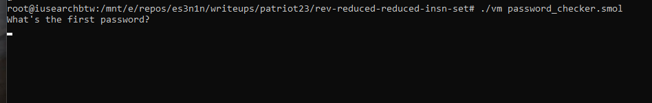
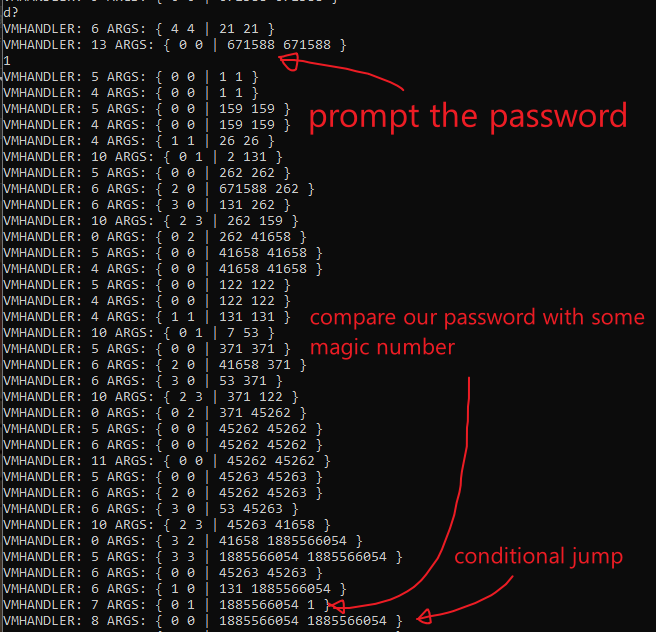
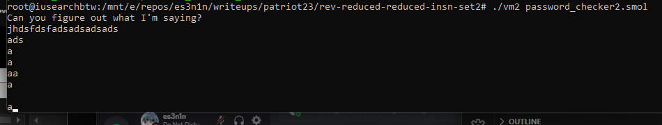
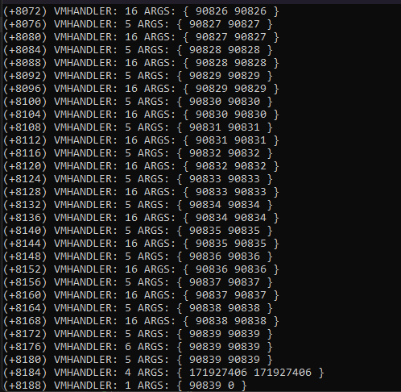
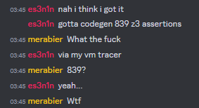
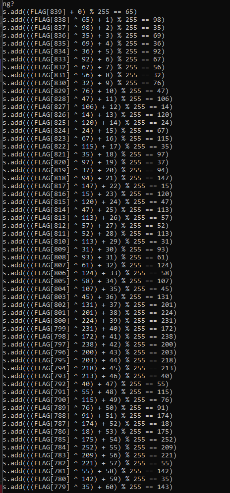
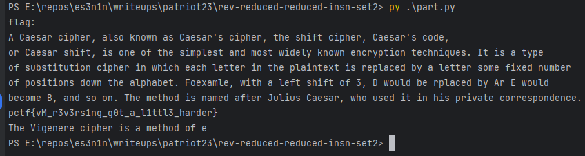

#### Description

_I'm going to explain how i solved(and cough.. cough.., first-blooded) both parts of this challenge so here are the descriptions of these tasks_


I heard RISC was pretty good, so I reduced it some more! Check out my password checker program I wrote with it. \
Flag format: PCTF{} \
Author: @arrilius

I added a couple improvements to my reduced reduced instruction set and have another password checker program for you to check out! \
Flag format: PCTF{} \
Author: @arrilius


#### Overview

For both of these tasks, we get 2 files, the `vm` binary and the `password_checker.smol` program bytecode


#### VM Structure

We're going to analyze 2 programs that are getting interpreted by one VM so here's a quick overview of how this VM works before we dig into the programs provided in the challenges

I'm not a fan of long descriptions of how something works, so here's the main code that would explain it better than me.

```cpp
  __endbr64();
  v7 = __readfsqword(0x28u);
  buf = 0;
  if ( argc <= 1 )
  {
    printf("Usage %s <program>\n", *argv);
    exit(0);
  }
  fd = open(argv[1], 0, envp);
  if ( fd < 0 )
  {
    printf("Could not open %s\n", argv[1]);
    exit(0);
  }
  if ( read(fd, &buf, 4uLL) <= 3 )
  {
    puts("Failed to read header");
    exit(0);
  }
  if ( strcmp((const char *)&buf, "SMOL") )
  {
    puts("Not a SMOL program");
    exit(0);
  }
  v4 = malloc(4uLL);
  if ( !v4 )
  {
    puts("malloc fail");
    exit(0);
  }
  v5 = malloc(0x20uLL);
  if ( !v5 )
  {
    puts("malloc fail");
    exit(0);
  }
  v5[3] = malloc(0x1000uLL);
  while ( 1 )
  {
    decode_instruction((unsigned int)fd, v4);
    execute_instruction((unsigned int)fd, v4, v5);
    clear_ins(v4);
  }
```

So basically each vm "descriptor" consists of 3 bytes:
- VMHandler ID
- Argument 1
- Argument 2 (optional)

There were 14 handlers in the first part of this task, and it was extended to 20 in the second part:
| ID | Name           | Pseudo                  | Added since |
|----|----------------|-------------------------|-------------|
| 0  | VM_MOV         | a1 = a2                 | Part 1      |
| 1  | VM_ADD_IMM     | a1 += a2 + a3           | Part 1      |
| 2  | VM_ADD_IMM_2   | a1 += a2 + a3           | Part 1      |
| 3  | VM_U_PRINT     | printf("%u", op1)       | Part 1      |
| 4  | VM_MOV_IMM     | a1 = a3                 | Part 1      |
| 5  | VM_PUSH        | sp += 8; *sp = val      | Part 1      |
| 6  | VM_POP         | sp -= 8; val = *sp      | Part 1      |
| 7  | VM_CMP         | fl = a1 - a2            | Part 1      |
| 8  | VM_JZ          | if (!fl) ip += a3       | Part 1      |
| 9  | VM_PRINT       | write(1, sp, a3)        | Part 1      |
| 10 | VM_MULADD      | a1 *= op2; a1 += a3     | Part 1      |
| 11 | VM_ADD         | a1 += a3                | Part 1      |
| 12 | VM_PROGEXIT    | exit(0)                 | Part 1      |
| 13 | VM_U_SCANF     | scanf("%u", op1)        | Part 1      |
| 14 | VM_XOR         | a1 ^= a2                | Part 2      |
| 15 | VM_SHR         | a1 >>= a3               | Part 2      |
| 16 | VM_GETCH       | a1 = getch()            | Part 2      |
| 17 | VM_SHL         | a1 <<= a3               | Part 2      |
| 18 | VM_SUB         | a1 -= a3                | Part 2      |
| 19 | VM_REM         | a1 %= a2                | Part 2      |

_a1 stands for argument1, a2 stands for argument2, a3 stands for the dynamic data that gets set within other handlers_

The cf is linear, which means that it would read 3 bytes chunk by chunk


#### Part 1

##### Part 1 - Analysing

When we start our program by using the `./vm password_checker.smol` command we can see that the program prompts us for 7 passwords



To trace/debug the vmhandlers i quickly built a tracer (the full code of it would be at the very end of this writeup)

And here's what happens as soon as we enter the password



Funny enough if we try to dump this integer as a string we get this
```
>>> int.to_bytes(1885566054, 4, 'big')
b'pctf'
>>>
```

##### Part 1 - Solving

Knowing that it simply checks the password with some other value we can patch the `VM_CMP` logic so that it will dump all these vars automatically

```cpp
case 7u: { // VM_CMP
    LODWORD(v3) = a3;

    *v6 = *v5; // spoof check
    *(_DWORD*)(a3 + 16) = *v5 - *v6;

    auto* cont = (uint8*)v6;
    for (int k = 3; k >= 0; --k)
        FLAG += (char)cont[k]; // remember flag
    break;
}
```

And print it at the end of the program

```cpp
case 12: { // VM_PROGEXIT
    printf("FLAG IS: %s\n", FLAG.c_str());
    exit(0);
}
```

Starting the emulator/tracer/debugger/whatever, entering some dummy integers aaand

```
VMHANDLER: 4 ARGS: { 0 0 | -826287586 -826287586 }
VMHANDLER: 4 ARGS: { 1 1 | 94 94 }
VMHANDLER: 10 ARGS: { 0 1 | 43 61 }
VMHANDLER: 5 ARGS: { 0 0 | 2623 2623 }
VMHANDLER: 9 ARGS: { 0 0 | 2623 2623 }
VMHANDLER: 6 ARGS: { 4 4 | -826287586 -826287586 }
VMHANDLER: 12 ARGS: { 0 0 | 2623 2623 }
FLAG IS: pctf{vm_r3vers3inG_1s_tr}000
```

##### Part 1 - Flag

`pctf{vm_r3vers3inG_1s_tr}`

#### Part 2

##### Part 2 - Analysing

As soon as we launch the program, it asks for a huge amount of chars and my first thought was that i need to patch them out, That wasn't a very good idea of mine



So after i tried to patch all these getches out, i decided to just skip the getch logic and write some dummy numbers to the registers instead

```cpp
case 16: // VM_GETCH
    v4 = 90000 + inp_count++;
    
    //v4 = _getch();
    LODWORD(v3) = (_DWORD)v6;
    *v6 = v4;
    break;
```

So now when we run it we can see that the actual number of chars that it reads is equal to 839



And now when we have all the logs we can find out how it actually checks our 839 chars.

How it check the last char
```cpp
(+8188) VMHANDLER: 1 ARGS: { 90839 0 } // load flag[839]
(+8192) VMHANDLER: 4 ARGS: { 238 238 }
(+8196) VMHANDLER: 19 ARGS: { 90839 255 } // % 255 it
(+8200) VMHANDLER: 4 ARGS: { 255 59 }
(+8204) VMHANDLER: 7 ARGS: { 59 65 } // compare it with 65
(+8208) VMHANDLER: 8 ARGS: { 59 65 } // jnz
```

How it check other chars
```cpp
(+8512) VMHANDLER: 5 ARGS: { 90838 90838 } // load flag[839]
(+8516) VMHANDLER: 4 ARGS: { 238 238 }
(+8520) VMHANDLER: 14 ARGS: { 90838 65 } // ^= 55
(+8524) VMHANDLER: 4 ARGS: { 0 0 }
(+8528) VMHANDLER: 1 ARGS: { 90775 1 } // += 1
(+8532) VMHANDLER: 4 ARGS: { 65 65 }
(+8536) VMHANDLER: 19 ARGS: { 90776 255 } // % 255
(+8540) VMHANDLER: 4 ARGS: { 255 251 }
(+8544) VMHANDLER: 7 ARGS: { 251 98 } // compare with 98
(+8548) VMHANDLER: 8 ARGS: { 251 98 } // jnz

(+8852) VMHANDLER: 5 ARGS: { 90837 90837 } // load flag[837]
(+8856) VMHANDLER: 4 ARGS: { 238 238 }
(+8860) VMHANDLER: 14 ARGS: { 90837 98 } // ^= 98
(+8864) VMHANDLER: 4 ARGS: { 1 1 }
(+8868) VMHANDLER: 1 ARGS: { 90807 2 } // += 2
(+8872) VMHANDLER: 4 ARGS: { 98 98 } 
(+8876) VMHANDLER: 19 ARGS: { 90809 255 } // % 255
(+8880) VMHANDLER: 4 ARGS: { 255 29 }
(+8884) VMHANDLER: 7 ARGS: { 29 35 } // compare with 35
(+8888) VMHANDLER: 8 ARGS: { 29 35 } // jnz

// and so on...
// the values that it xors with and results aren't predictable
```

##### Part 2 - Solving

Knowing how it checks our flag i thought that i didn't want to manually write 839 assertions and i should generate them instead



To do that i added a check in my getch implementation to skip the first inputs and start dumping right at the time when it starts comparing it

```cpp
case 0x10: // VM_GETCH
    v4 = 90000 + inp_count++;

    if (!checked)
        checked = pos == 8168; // pos - vIP
    LODWORD(v3) = (_DWORD)v6;
    *v6 = v4;
    break;
```

And then whenever the checked bool is set to true we need to start degenerating our assertions

I am just gonna drop it as it is, CBA refactoring it
```cpp
if (checked) {
    auto name_op = [](int op) -> std::string {
        if (op < 90'000)
            return std::to_string(op);
        return "FLAG[" + std::to_string(op - 90'000) + "]";
    };
    
    auto set = []() -> void {
        if (!st)
            st = true;
    };

    switch (*a2) {
    case 5:
    case 6:
    case 4:
    case 9:
        break;

    case 14:
        if (!st) {
            std::cout 
                << "s.add(((" 
                << name_op(*v6) 
                << " ^ " 
                << name_op(*v7) 
                << ")";
        } else {
            std::cout 
                << "^" 
                << *v7;
        }
        set();
        break;

    case 1:
        if (!st) {
            std::cout 
                << "s.add((" 
                << name_op(*v6) 
                << " + " 
                << name_op(*v7) 
                << ")";
        }
        else {
            std::cout 
                << " + " 
                << *v7 
                << ")";
        }
        set();
        break;

    case 19:
        std::cout << " % " << *v7;
        set();
        break;

    case 7:
        std::cout << " == " << *v7 << ")";
        set();
        break;

    case 8:
        std::cout << std::endl;
        st = false;
        break;

    default:
        printf("UNKNOWN %d %d %d\n", *a2, *v6, *v7);
        __debugbreak();
        break;
    }
}
```

The `st` bool here would be set to true if we already parsing an expression and set to false if we're at the beginning of it(so that we should add the s.add part)

And when i ran it i got these



I pasted all these constraints into my python3 solver aaaand.. it didn't work, it produced an `unsat`. I commented half of them and it produced a buffer that's length was long enough to get the flag (you can check out this script in the attachments section, it is reaalllly long to fit here)




##### Part 2 - Flag

`pctf{vM_r3v3rs1ng_g0t_a_l1ttl3_harder}`


#### Attachments

[emulator.cpp](https://github.com/cr3mov/writeups/blob/master/patriot23-rev-reduced-reduced-instruction-set-1and2/attachments/emulator.cpp)

[part2solver.py](https://github.com/cr3mov/writeups/blob/master/patriot23-rev-reduced-reduced-instruction-set-1and2/attachments/part2solver.py)
