## Description

Perfect Blu (135 pt)

No, I'm real!

[perfect-blu.tar.gz](./challenge/perfect-blu.tar.gz) 367b6ed67dda0afbbc975ee70ee946b4c7bf9268


#### Overview

Once I opened the downloaded `.tar.gz` file, I noticed there was a `.iso` file inside. 
When I mounted it, I saw that it had a file structure that looked like fs structure of a DVD. 
I then dragged this `.iso` file into VLC and got very surprised

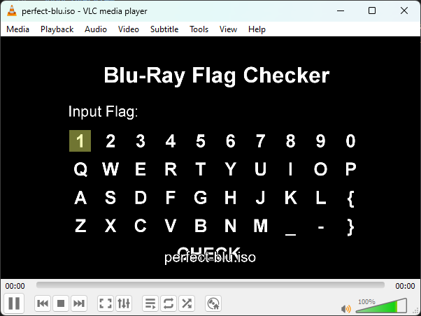

As you have probably already figured out, this task is a DVD image with an interactive menu asking you to enter the flag.
Pressing the `CHECK` button shows either `SUCCESS` or `WRONG...` message, depending on the flag entered

#### Analysing

_I'm gonna be completely honest, I've never had any experience with all this DVD stuff before, so I had to spend a couple of hours googling how to analyse this stuff first._

Apparently, there are multiple types of DVD menus:
- Java Menus
- IGS Menus

I first checked for any `.jar` files (or anything at all Java-related), but found nothing, which meant that I was dealing with IGS menu.

The first step in IGS menu analysis is to download [BDEdit](https://bdedit.pel.hu/) and open up our mounted `BDMV\index.bdmv`

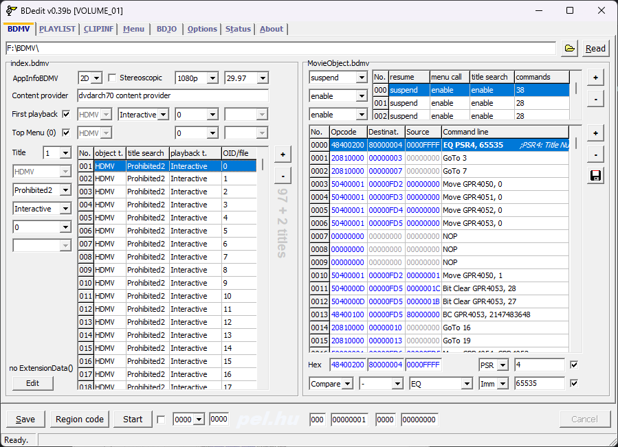

Looks scary. I know.
The first thing I did was to check the stream's first clip information, looking for any bytecode or anything else of interest. 
I did this by clicking on the `CLIPINFO` menu.

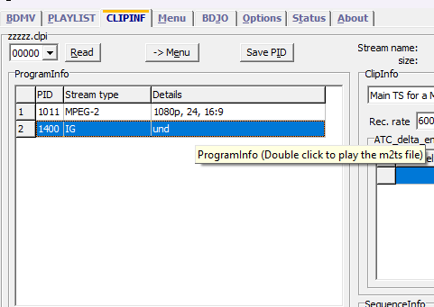

Here, at the top left corner, there's a combo box with a clip selector.
There are 96 clips and all of them have some buttons. 

Within that menu, I reviewed each stream and identified the `und` stream which appeared to store the bytecode. 
When I double-clicked on it, the menu with buttons opened up and I saw a lot of buttons and the disassembly of the code that they were doing:

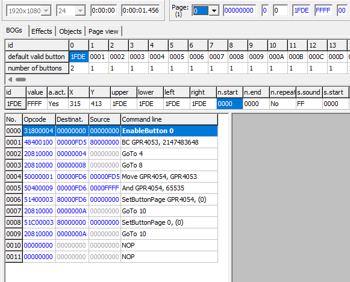

By messing around and guessing I found that the first default valid button (`1FDE` on the screenshot above) contains some random stuff I wasn't interested in, which meant I should check others instead.

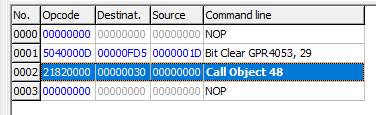

In this bytecode there's a `Call Object **` instruction (opcode `21820000`). 
This instruction simply starts playing another menu provided as its first operand. 
Knowing this, I started analysing what the other buttons were doing.


By observing all the other buttons I saw three types of buttons.

---

**JumpTo48** - Most buttons will take you from the current menu to menu 48.


---

**JumpTo1** - This button takes you from the current menu to menu 1.

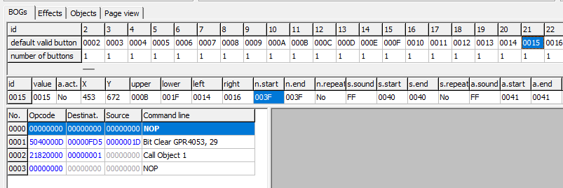

---

**JumpTo96** - This button takes you from the current menu to menu 96.

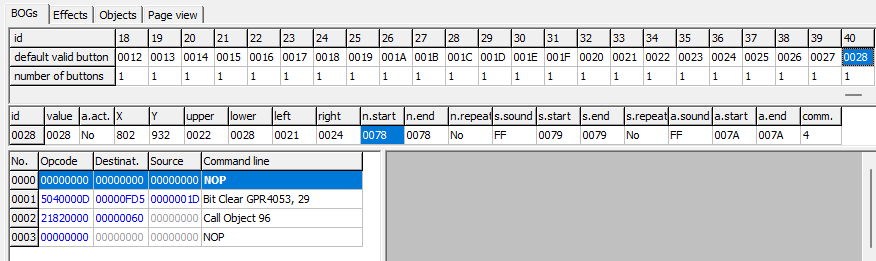

Jumping from clip 0 to clip 96, huh? I checked the clip 96 by playing the `BDMV\STREAM\00096.m2ts` file in VLC and got this:

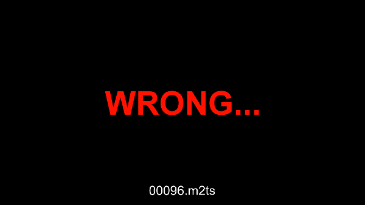

---

At this point, I knew that there were only three destinations in the first menu
* Clip 1
* Clip 48
* Clip 96 (`WRONG...`) 

When exploring other clips(1, 48) in VLC, all seemed to show the same controls prompting for the flag.

Let's define this behavior as a pattern that we can then match with other menus:
* Jump to `CURRENT + 1` (1, in this case)
* Jump to `96` (`WRONG...`)
* Jump to `CURRENT + 48` (48, in this case)

I didn't want to end up on scene 96, so i checked the menus 1 and 48.

When i opened up the menu 1 in BDEdit i clearly saw the same pattern that i saw in menu 0.

Moving on to menu 48, and the pattern observed was mostly the same, but there were only 2 type of buttons:
* Jump to `CURRENT + 1` (49)
* Jump to `96` (`WRONG`)
Basically, the 2 types of buttons got merged and it was jumping to only 2 destinations.

Seems odd, huh? 
Instead of 3 directions of the codeflow we got only 2, and one of it was just showing the `WRONG` message.
I investigated it a bit further, and it seemed like we would always end up on the menu 96 if we are on the menu that's index is >= 48.

There's one exception though, which I just guessed. Remember how I opened stream 96 in vlc? Well, I did the same thing for clip 95 and got this:

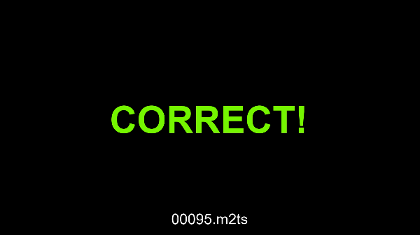

From now on solving this challenge seemed trivial, 
I just needed to parse all the clips and find what buttons lead to clip 95.

#### Solving

While the idea was easy enough, I struggled for half an hour trying to parse the clips.

I tried a bunch of libraries to parse the clips and extract the bytecode from them.
However, none of them worked, so I decided I should just do it myself.

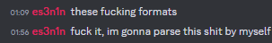

I grabbed the `Call Object` instruction opcode (`21820000`)
and searched for it in HxD across the entire ISO.

I ended up in the same m2ts files where I got a lot of occurrences. 
I assumed that this bytecode is indeed stored in the same file as the stream itself, 
so I should parse it directly from those files

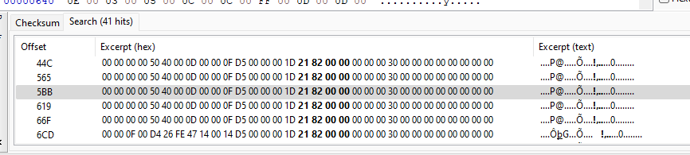

When assembled, this instruction looks like this:
```js
>───────┐ ┌───────┐ ┌───────> │
2182 0000 0000 0030 0000 0000 │ !......0....
│         │         │
2182──────│─────────│───────────────────────── Opcode
          30────────│───────────────────────── Operand 1
                    00──────────────────────── Operand 2
```

Let's write all of these as the constants for the solver

```py
OPCODE_SIZE: int = 4
OPERAND_SIZE: int = 4
INSN_SIZE = OPCODE_SIZE + (OPERAND_SIZE * 2)

CALL_OBJECT = b'\x21\x82\x00\x00'  # Call Object {DST}
```

After that, I iterated over the first 47 streams and extracted their buttons.
```py
# Returns { button_id: jmp_to }
def parse_buttons(mnu_data: bytes) -> dict[int, int]:
    result = dict()
    i = 0
    start_off = 0

    while True:
        # Searching for `Call Object` opcode
        s = mnu_data.find(CALL_OBJECT, start_off)
        if s == -1:
            break

        # Move next iter
        start_off = s + INSN_SIZE

        # Read the current chunk and extract op1 from it
        chunk = mnu_data[s:s + INSN_SIZE]
        op1 = int.from_bytes(chunk[4:8], 'big')

        # Save the dst
        result[i] = op1
        i += 1

    return result


# menu index -> buttons from `parse_buttons`
menus: dict[int, dict[int, int]] = dict()


for menu in p2.iterdir():
    menu_id = int(menu.name.split('.')[0])
    if menu_id > 47:
        break

    with open(menu, 'rb') as f:
        content = f.read()

    menus[menu_id] = parse_buttons(content)
```

At this point, I already had all the playlists and parsed buttons from these playlists. To make the other logic a bit easier to implement, I collected all the successors and predecessors for menus into separate dicts.
```py
# menu index -> possible exits
menus_possibilities: dict[int, list[int]] = dict()
# menu index -> { jmp_dst: [buttons] }
menus_referrers: dict[int, dict[int, list[int]]] = dict()

for key in sorted(menus.keys()):
    value = menus[key]
    menus_possibilities[key] = list()
    menus_referrers[key] = dict()

    for k, possible_value in value.items():
        if possible_value not in menus_referrers[key]:
            menus_referrers[key][possible_value] = list()

        menus_referrers[key][possible_value].append(k)

        if possible_value in menus_possibilities[key]:
            continue
        menus_possibilities[key].append(possible_value)
```

Now, the solution to this challenge is basically a path from menu 0 to menu 95:
```py
# menu -> button
path: dict[int, int] = dict()

for k, v in menus_possibilities.items():
    tgt = None

    # Selecting the first menu that id is <=47 (or 95)
    for possible_move in v:
        if possible_move > 47 and possible_move != 95:
            continue

        tgt = possible_move
        break

    if not tgt:
        print('[!] Unknown tgt?!')
        break

    path[k] = menus_referrers[k][tgt][0]
    print('[+] Menu:', k, 'Button:', path[k], 'Next:', tgt)
```

Looking at the output below, I tried to guess what alphabet 
I needed to use to convert these numbers to characters.
```js
[+] Menu: 0 Button: 21 Next: 1
[+] Menu: 1 Button: 12 Next: 2
[+] Menu: 2 Button: 32 Next: 3
[+] Menu: 3 Button: 32 Next: 4
[+] Menu: 4 Button: 18 Next: 5
[+] Menu: 5 Button: 35 Next: 6
[+] Menu: 6 Button: 29 Next: 7
...
```

The first button that I should click on is 21. 
Knowing that the flag starts with `SECCON{`, I know that the first char is `S` with ID 21.
I looked at the button layout to decode the alphabet:
```js
1 2 3 4 5 6 7 8 9 0
Q W E R T Y U I O P
A S D F G H J K L {
Z X C V B N M _ - }
```

And oh well, when I concatenated it to a single string `1234567890QWERTYUIOPASDFGHJKL{ZXCVBNM_-}` 
and searched for `S` there, I got:
```py
>>> '1234567890QWERTYUIOPASDFGHJKL{ZXCVBNM_-}'.find('S')
21
>>>
```

All I had left to do is to just grab all the button IDs 
and convert them to characters using this alphabet:
```py
ALPHABET = '1234567890QWERTYUIOPASDFGHJKL{ZXCVBNM_-}'
FLAG: str = ''

for k, v in path.items():
    if v >= len(ALPHABET):
        break

    FLAG += ALPHABET[v]

print('[+] Flag:', FLAG)
```

Which _finally_ produced the flag.


#### Flag
`SECCON{JWBH-58EL-QWRL-CLSW-UFRI-XUY3-YHKK-KFBV}`

#### Full solver source

```py
from pathlib import Path


p2 = Path(__file__).parent / 'menus'
# p2 = Path('F:\\BDMV\\STREAM')

"""
95 - win
96 - lose
"""

# DST - first operand
# SRC - second operand

# in bytes
OPCODE_SIZE: int = 4
OPERAND_SIZE: int = 4
INSN_SIZE = OPCODE_SIZE + (OPERAND_SIZE * 2)

BIT_CLEAR = b'\x50\x40\x00\x0D'  # Bit Clear GPR{DST}, {SRC}
CALL_OBJECT = b'\x21\x82\x00\x00'  # Call Object {DST}


# Returns { button_id: jmp_to }
def parse_buttons(mnu_data: bytes) -> dict[int, int]:
    result = dict()
    i = 0
    start_off = 0

    while True:
        s = mnu_data.find(CALL_OBJECT, start_off)
        if s == -1:
            break

        start_off = s + INSN_SIZE

        chunk = mnu_data[s:s + INSN_SIZE]

        # opcode = int.from_bytes(chunk[:4], 'big')
        op1 = int.from_bytes(chunk[4:8], 'big')
        # op2 = int.from_bytes(chunk[8:], 'big')

        # print('[+] i =', i, 'CALL_OBJECT', op1, op2)
        result[i] = op1

        i += 1

    return result


# menu index -> buttons from `parse_buttons`
menus: dict[int, dict[int, int]] = dict()


for menu in p2.iterdir():
    menu_id = int(menu.name.split('.')[0])
    if menu_id > 47:
        break

    with open(menu, 'rb') as f:
        content = f.read()

    menus[menu_id] = parse_buttons(content)


# menu index -> possible exits
menus_possibilities: dict[int, list[int]] = dict()
# menu index -> { jmp_dst: [buttons] }
menus_referrers: dict[int, dict[int, list[int]]] = dict()

for key in sorted(menus.keys()):
    value = menus[key]
    menus_possibilities[key] = list()
    menus_referrers[key] = dict()

    for k, possible_value in value.items():
        if possible_value not in menus_referrers[key]:
            menus_referrers[key][possible_value] = list()

        menus_referrers[key][possible_value].append(k)

        if possible_value in menus_possibilities[key]:
            continue
        menus_possibilities[key].append(possible_value)


# menu -> button
path: dict[int, int] = dict()

for k, v in menus_possibilities.items():
    tgt = None

    # Selecting the first menu that id is <=47 (or 95)
    for possible_move in v:
        if (possible_move > 47 and possible_move != 95) or possible_move == 0:
            continue

        if tgt:
            print('[!] What should i choose master', tgt, possible_move)

        tgt = possible_move

    if not tgt:
        print('[!] Unknown tgt?!')
        break

    path[k] = menus_referrers[k][tgt][0]
    print('[+] Menu:', k, 'Button:', path[k], 'Next:', tgt)


ALPHABET = '1234567890QWERTYUIOPASDFGHJKL{ZXCVBNM_-}'
FLAG: str = ''

for k, v in path.items():
    if v >= len(ALPHABET):
        break

    FLAG += ALPHABET[v]

print('[+] Flag:', FLAG)

```
