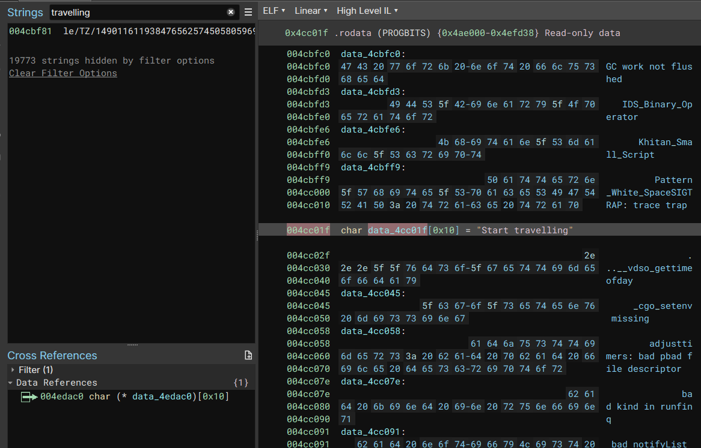

#### Description

Greetings, Travellers! Feel free to spend some time exploring the world of Teyvat, but remember...Some areas are too dangerous to explore alone.

Author: sahuang \
31 solves

#### Overview

There is only one attachment for this challenge and it's an ELF binary file named `genshin`, If we execute it on our machine the program will first ask us to solve the PoW

```
root@iusearchbtw:/mnt/c/Users/retard/Downloads# ./genshin
proof of work: curl -sSfL https://pwn.red/pow | sh -s s.AAATbA==.a9A4A9Am4LadegCDAekr1A==
solution:
```

After we solve the pow we can see that the app is rendering some grid, safe to assume that it is some sort of a maze


At the time when I was solving it, I tried to press the W/A/S/Arrow keys and nothing really worked, the X character didn't move, eh which sucks, well, let's open it up in binja

#### Analysing

As soon as we open the `genshin` binary in binja we can see that this binary was created using the golang :sob:

In order to not waste time by analysing statically linked libc, we can find the main function that renders the maze by looking up the string xrefs




By looking at the function where we end up we can see that we're in the function that checks our proof of work


By looking for the xrefs to this function we can find the main function, the function that we were looking for, where all the magic happens 

If we scroll the HLIL a bit we clearly see that it checks for the `R` and `D` keys


And if we try to press these keys while the program is running we can observe that our X is moving from cell to cell, R = x+1, D = y+1

The whole idea of this challenge is that there's a maze and each cell has its value (signed, meaning that it can either add pts or remove pts), each time you move from cell to cell your score gets increased/decreased.


The condition when the program would print us the flag is when we reach the `(47,47)` coordinates and our score is equal to `1`


#### Map generation

At the very beginning of this function, there's a suspicious loop in the range 48x48, it's suspicious only because the size of our maze is 48x48 too, if we look at it a bit we can see that it's saving some integers in the heap or something, weird.


The way how it's storing `(&var_480)[r8_1] = 0x30` and `*(&var_478 + (r8_1 << 3)) = 0x30` made me think that this is a struct that holds the map grid info since 0x30 in decimal is 48, so the grid row struct would be as follows:

```cpp
struct row_t {
public:
    std::int32_t size_x;
    std::int32_t size_y;
    std::int32_t* cells;
}
```

I guessed that the last field is storing the cells data only because of the way it was generating the `rax_1` property and saved it right after the row dimensions.

The whole reversed map generation algorithm pseudocode is:

```cpp
for (int64_t i = 0; i s< 48; i = i_2 + 1)
    int64_t rax_1
    // alloc cell data
    rax_1, rsi_1, rdi_1, zmm15 = sub_44cea0(
        rdi_1.d, rsi_1, i_2, 0x30, &data_4b6300, 0x30, arg1
    )

    int64_t var_4f0_1 = rax_1
    for (int64_t j = 0; j s< 0x30; j = j + 1)
        int64_t rax_16
        // generate the cell data (it returns a signed i32)
        // basically the number of points that this cell is 
        // going to add to our score
        rax_16, rsi_1, rdi_1, zmm15 = sub_4a5120(
            data_57baa0, 0x33, rbp, arg1
        )
        rax_1 = var_4f0_1
        *(rax_1 + (j << 3)) = rax_16 - 0x28 // save weight
    
    i_2 = i

    int64_t r8_1 = i_2 * 3 // convert index to the offset
    (&var_480)[r8_1] = 0x30 // save x
    void var_478
    *(&var_478 + (r8_1 << 3)) = 0x30 // save y
    (&s)[r8_1] = rax_1 // save generated cells
```

#### Dumping the map

To be completely honest I didn't even analyse the `sub_4a5120` routine because it was producing the same map every time I restarted the map, that's why I cheated a bit and just dumped the map content using the Binary Ninja python API

```py

def main():
    bv = BinaryViewType.get_view_of_file("genshin")
    dbg = DebuggerController(bv)
    if not dbg.launch():
        print('oh noes!')
        return
    
    # as soon as the map gets generated
    dbg.run_to(0x4abbb6)

    rsp = dbg.get_reg_value('rsp')
    map_data = rsp + 0x98

    def get_qword(va):
        return int.from_bytes(
            dbg.read_memory(
                va, 
                8
            ), 
            'little'
        )

    def read_from_map(off):
        return get_qword(map_data + (off * 8))

    for i in range(49):
        v4 = 3 * i
        
        limit1 = read_from_map(v4 + 1)
        row = read_from_map(v4 + 2)
        limit2 = read_from_map(v4)
        
        print('[ ', end='')
        for j in range(48):
            print('{:<18}'.format(hex(get_qword(row + (8 * j)))), end=', ')
            
        print(']')

main()
```

And this produced us this output
```
# [ 0xffffffffffffffff, 0xffffffffffffffff, 0xffffffffffffffff, 0xffffffffffffffff, 0xffffffffffffffff, 0xffffffffffffffff, 0xffffffffffffffff, 0xffffffffffffffff, 0xffffffffffffffff, 0xffffffffffffffff, 0xffffffffffffffff, 0xffffffffffffffff, 0xffffffffffffffff, 0xffffffffffffffff, 0xffffffffffffffff, 0xffffffffffffffff, 0xffffffffffffffff, 0xffffffffffffffff, 0xffffffffffffffff, 0xffffffffffffffff, 0xffffffffffffffff, 0xffffffffffffffff, 0xffffffffffffffff, 0xffffffffffffffff, 0xffffffffffffffff, 0xffffffffffffffff, 0xffffffffffffffff, 0xffffffffffffffff, 0xffffffffffffffff, 0xffffffffffffffff, 0xffffffffffffffff, 0xffffffffffffffff, 0xffffffffffffffff, 0xffffffffffffffff, 0xffffffffffffffff, 0xffffffffffffffff, 0xffffffffffffffff, 0xffffffffffffffff, 0xffffffffffffffff, 0xffffffffffffffff, 0xffffffffffffffff, 0xffffffffffffffff, 0xffffffffffffffff, 0xffffffffffffffff, 0xffffffffffffffff, 0xffffffffffffffff, 0xffffffffffffffff, 0xffffffffffffffff, ]
[ 0x0               , 0xffffffffffffffea, 0xffffffffffffffe9, 0xfffffffffffffffc, 0xffffffffffffffe9, 0xa               , 0xffffffffffffffd8, 0xfffffffffffffff2, 0xfffffffffffffff5, 0xffffffffffffffde, 0xffffffffffffffd9, 0x2               , 0xffffffffffffffe8, 0xffffffffffffffff, 0x5               , 0xffffffffffffffe6, 0x3               , 0xfffffffffffffff1, 0xfffffffffffffff6, 0xffffffffffffffdf, 0xffffffffffffffde, 0xfffffffffffffffd, 0xa               , 0x3               , 0xffffffffffffffe5, 0xffffffffffffffe6, 0x6               , 0xfffffffffffffff6, 0xffffffffffffffdc, 0xffffffffffffffdf, 0xffffffffffffffe3, 0xffffffffffffffe3, 0xffffffffffffffe1, 0xfffffffffffffff6, 0xfffffffffffffff3, 0x2               , 0xffffffffffffffe0, 0xffffffffffffffdb, 0xfffffffffffffffd, 0xa               , 0xffffffffffffffdb, 0xffffffffffffffe6, 0x2               , 0xfffffffffffffff5, 0xffffffffffffffe5, 0xfffffffffffffff4, 0x6               , 0xffffffffffffffed, ]
...
```

#### Solving the maze

Initially, we thought that we start at (0,0) coordinates from this dumped map, but when we solved the maze and tested it, our score wasn't equal to -1, weird huh? I debugged it and found out that we start at 1,1 from this map, but it was a bit too late because we already coded some insane triple bfs solvers to verify our solutions, we basically wasted a huge amount of time only because of that. Too bad that i didn't debug it right at the beginning :shrug:

So after hours of trying to solve an impossible-to-solve maze, we got these:

The maze solver
```py
teyvat = [...]
cords = (0, 0)

def neg_to_pos(v):
    v = (~v) % (1 << 64)
    return v + 1

print(neg_to_pos(teyvat[47][47]))

g = [[0 for i in range(len(teyvat[0]))] for j in range(len(teyvat))]
p = [[0 for i in range(len(teyvat[0]))] for j in range(len(teyvat))]

g[47][47] = 1 + neg_to_pos(teyvat[47][47])
p[47][47] = (47, 47)

steps = [
  (1, 0),
  (0, 1)
]

q = [(47, 47)]
while len(q) > 0:
    v = q.pop(0)

    for s in steps:
        to = (v[0] - s[0], v[1] - s[1])

        if to[0] < 0 or to[1] < 0:
            continue
          
        val = teyvat[to[1]][to[0]]
        if val > 0xffff:
          val = -neg_to_pos(val)

        if g[to[1]][to[0]] != 0 and g[to[1]][to[0]] <= g[v[1]][v[0]] - val:
            continue

        g[to[1]][to[0]] = g[v[1]][v[0]] - val
        p[to[1]][to[0]] = v
        q.append(to)

print()

p1 = [[0 for i in range(len(teyvat[0]))] for j in range(len(teyvat))]
g1 = [[0 for i in range(len(teyvat[0]))] for j in range(len(teyvat))]
g1[0][0] = 333
p1[0][0] = (0, 0)
q = [(0, 0)]
while len(q) > 0:
    v = q.pop(0)

    for s in steps:
        to = (v[0] + s[0], v[1] + s[1])

        if to[0] > 47 or to[1] > 47:
            continue
          
        val = teyvat[to[1]][to[0]]
        if val > 0xffff:
          val = -neg_to_pos(val)

        if g1[to[1]][to[0]] != 0 and g1[to[1]][to[0]] >= g1[v[1]][v[0]] + val:
            continue

        p1[to[1]][to[0]] = v
        g1[to[1]][to[0]] = g1[v[1]][v[0]] + val
        q.append(to)

def brute_force(y, x, cur_pts, cur_path):
    
    if cur_pts < 0:
        return cur_path

    if y == 47 and x == 47 and cur_pts == (1 + neg_to_pos(teyvat[47][47])):
        print(cur_path)
        exit(0)

    if y == 48 or x == 48:
        return cur_path
    
    val = teyvat[y][x]
    if val > 0xffff:
      val = -neg_to_pos(val)

    brute_force(y + 1, x, cur_pts + val, cur_path + [(x, y + 1)])
    brute_force(y, x + 1, cur_pts + val, cur_path + [(x + 1, y)])

def test_path(y, x):
    # (x, y) is same cost point between g1 and g
    #print()
    f = [(x, y)]
    while f[-1] != (0, 0):
        v = f[-1]
        f.append(p1[v[1]][v[0]])

    val = teyvat[y][x]
    if val > 0xffff:
      val = -neg_to_pos(val)
    f.reverse()
    brute_force(y, x, g1[y][x] - val, f)

for y in range(47, 0, -1):
    for x in range(47, 0, -1):
        if g[y][x] == g1[y][x]:
            test_path(y, x)
```

Solution validator
```py
path = [(0, 0), (0, 1), (0, 2), (0, 3), (0, 4), (0, 5), (1, 5), (2, 5), (2, 6), (2, 7), (3, 7), (4, 7), (5, 7), (5, 8), (6, 8), (6, 9), (6, 10), (7, 10), (7, 11), (8, 11), (8, 12), (8, 13), (9, 13), (10, 13), (10, 14), (11, 14), (12, 14), (13, 14), (14, 14), (15, 14), (15, 15), (16, 15), (17, 15), (17, 16), (17, 17), (18, 17), (19, 17), (19, 18), (19, 19), (19, 20), (20, 20), (20, 21), (21, 21), (22, 21), (22, 22), (23, 22), (23, 23), (24, 23), (25, 23), (26, 23), (26, 24), (26, 25), (27, 25), (28, 25), (29, 25), (29, 26), (30, 26), (30, 27), (31, 27), (32, 27), (33, 27), (34, 27), (34, 28), (34, 29), (34, 30), (35, 30), (36, 30), (37, 30), (37, 31), (37, 32), (38, 32), (39, 32), (40, 32), (41, 32), (42, 32), (42, 33), (42, 34), (42, 35), (42, 36), (42, 37), (43, 37), (44, 37), (44, 38), (44, 39), (45, 39), (46, 39), (46, 40), (46, 41), (47, 41), (47, 42), (47, 43), (47, 44), (47, 45), (47, 46), (47, 47)]

cmd = []

for i in range(1, len(path)):
  prev = path[i - 1]
  cur = path[i]

  if prev[1] < cur[1]:
      cmd.append('D')
  else:
      cmd.append('R')
cur_pts = 333
pos = (0, 0)

print(cmd)

MAP = [...]
def neg_to_pos(v):
    v = (~v) % (1 << 64)
    return v + 1

for act in cmd:
    if act == "R":
        pos = (pos[0] + 1, pos[1])
    else:
        pos = (pos[0], pos[1] + 1)
    
    val = MAP[pos[1]][pos[0]]
    if val > 0xffffff:
      val = -neg_to_pos(val)

    cur_pts += val

    if pos[1] == 0:
        print(cur_pts)

    if cur_pts <= 0:
        print("TI EBUCHIY HUESOS, EBAL TVOY ROT")
        print(pos)
        break

print(cur_pts)
print(pos)
```

And after solving the maze with the right map grids we get the following path that we should send to the app, in order to get the score 1 at the end of the maze `(47, 47)`

```py
['D', 'D', 'D', 'D', 'D', 'R', 'R', 'D', 'D', 'R', 'R', 'R', 'D', 'R', 'D', 'D', 'R', 'D', 'R', 'D', 'D', 'R', 'R', 'D', 'R', 'R', 'R', 'R', 'R', 'D', 'R', 'R', 'D', 'D', 'R', 'R', 'D', 'D', 'D', 'R', 'D', 'R', 'R', 'D', 'R', 'D', 'R', 'R', 'R', 'D', 'D', 'R', 'R', 'R', 'D', 'R', 'D', 'R', 'R', 'R', 'R', 'D', 'D', 'D', 'R', 'R', 'R', 'D', 'D', 'R', 'R', 'R', 'R', 'R', 'D', 'D', 'D', 'D', 'D', 'R', 'R', 'D', 'D', 'R', 'R', 'D', 'D', 'R', 'D', 'D', 'D', 'D', 'D', 'D']
```

#### Solving

So now that we have everything to get the flag we just simply connect to the remote instance of this challenge, send our inputs and get the flag

```py
from pwn import *
from subprocess import run
from subprocess import PIPE
from time import sleep


io = remote('chals.sekai.team', 7000)

# @note: @es3n1n: feelin' lazy
pow_cmd = io.recvline().decode().split('work:')[1].strip()
result = run(['bash', '-c', pow_cmd], stdout=PIPE)
pow_solved = result.stdout.decode()

io.sendline(pow_solved.encode())

stuff = ['D', 'D', 'D', 'D', 'D', 'R', 'R', 'D', 'D', 'R', 'R', 'R', 'D', 'R', 'D', 'D', 'R', 'D', 'R', 'D', 'D', 'R', 'R', 'D', 'R', 'R', 'R', 'R', 'R', 'D', 'R', 'R', 'D', 'D', 'R', 'R', 'D', 'D', 'D', 'R', 'D', 'R', 'R', 'D', 'R', 'D', 'R', 'R', 'R', 'D', 'D', 'R', 'R', 'R', 'D', 'R', 'D', 'R', 'R', 'R', 'R', 'D', 'D', 'D', 'R', 'R', 'R', 'D', 'D', 'R', 'R', 'R', 'R', 'R', 'D', 'D', 'D', 'D', 'D', 'R', 'R', 'D', 'D', 'R', 'R', 'D', 'D', 'R', 'D', 'D', 'D', 'D', 'D', 'D']

for k in stuff:
    io.sendline(k.encode())
    sleep(.01)


io.interactive()
```

#### Flag

`SEKAI{Klee_was_a_brave_girl_today!_I_found_a_really_weird-looking_lizard!_Want_me_to_show_it_to_you?}`
